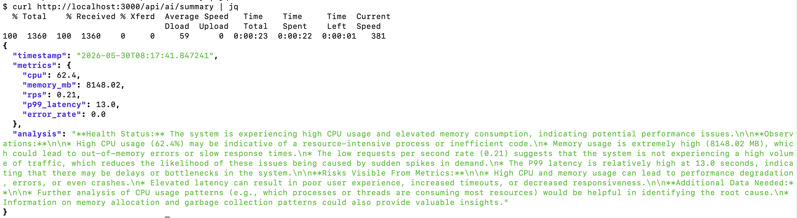
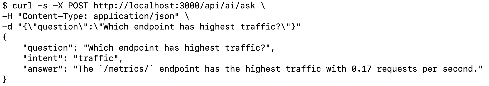

# LLM Observability Platform

A production-inspired observability platform for LLM applications built using OpenWebUI, LiteLLM, Ollama, Langfuse, Prometheus, and Grafana.

The platform provides end-to-end monitoring, tracing, performance analysis, and infrastructure visibility for self-hosted LLM workloads. 
It extends OpenWebUI with custom Prometheus instrumentation and Grafana dashboards to improve operational visibility, debugging, and performance analysis.


---

# Features

* ✅ Local LLM inference using Ollama (Llama 3)
* ✅ LiteLLM proxy integration
* ✅ Langfuse tracing and monitoring
* ✅ Custom Prometheus instrumentation
* ✅ HTTP request metrics and latency tracking
* ✅ PostgreSQL monitoring
* ✅ Redis monitoring
* ✅ Grafana dashboards
* ✅ Per-endpoint observability
* ✅ HTTP status code monitoring (2xx/4xx/5xx)
* ✅ P99 latency tracking
* ✅ Endpoint normalization to prevent metric cardinality explosion
* ✅ AI-powered observability assistant 
* ✅ Automated health summaries (/api/ai/summary)
* ✅ Natural language observability queries (/api/ai/ask)
* ✅ Intent-based query routing 
* ✅ Prometheus-backed AI responses 
* ✅ Redis health analysis 
* ✅ PostgreSQL health analysis 
* ✅ Endpoint traffic analysis 
* ✅ Endpoint latency analysis

---

# Project Status

✅ v1.0 Completed  
✅ v1.1 Completed  
✅ v1.2 Completed  
🚧 v1.3 Planned

---

# Overview

Modern LLM applications require visibility across application requests, infrastructure components, and model interactions. This project was built to provide a unified observability layer for an OpenWebUI-based LLM stack.

The platform collects and visualizes:

* LLM request traffic
* Endpoint-level request rates
* HTTP latency and P99 response times
* HTTP status code distribution
* Redis health metrics
* PostgreSQL connection metrics
* Process resource consumption
* System-level CPU and memory utilization
* Langfuse traces for LLM interactions

The platform also includes an AI-powered observability assistant that analyzes Prometheus metrics using LiteLLM and Llama 3 to generate health summaries and answer natural language observability questions.
The goal is to provide production-style monitoring and telemetry for local and self-hosted LLM environments.

---

# Architecture

```text
                        ┌─────────────────┐
                        │      User       │
                        └────────┬────────┘
                                 │
                                 ▼
                     ┌──────────────────────────┐
                     │       OpenWebUI          │
                     │        Port 3000         │
                     └───────────┬──────────────┘
                                 │
                                 │ Chat Requests
                                 ▼
                     ┌──────────────────────────┐
                     │         LiteLLM          │
                     │        Port 4000         │
                     └───────────┬──────────────┘
                                 │
                                 │ Inference
                                 ▼
                     ┌──────────────────────────┐
                     │         Ollama           │
                     │        Llama 3           │
                     │       Port 11434         │
                     └──────────────────────────┘


     ┌─────────────────────────────────────────────────────────┐
     │                    LLM Observability                    │
     └─────────────────────────────────────────────────────────┘

                     ┌──────────────────────────┐
                     │        LiteLLM           │
                     │  OTEL / Langfuse Trace   │
                     └───────────┬──────────────┘
                                 │
                                 ▼
                     ┌──────────────────────────┐
                     │         Langfuse         │
                     │        Port 3100         │
                     └──────┬──────┬──────┬─────┘
                            │      │      │
                            │      │      │
                            ▼      ▼      ▼
                    ┌─────────┐ ┌──────┐ ┌────────────┐
                    │Postgres │ │Redis │ │ ClickHouse │
                    └─────────┘ └──────┘ └────────────┘
                                           │
                                           ▼
                                      ┌────────┐
                                      │ MinIO  │
                                      └────────┘


     ┌─────────────────────────────────────────────────────────┐
     │                    Metrics Pipeline                     │
     └─────────────────────────────────────────────────────────┘

                     ┌──────────────────────────┐
                     │       OpenWebUI          │
                     │ Custom Middleware &      │
                     │ Prometheus Metrics       │
                     └───────────┬──────────────┘
                                 │
                                 │ /metrics
                                 ▼
                     ┌──────────────────────────┐
                     │       Prometheus         │
                     │        Port 19090        │
                     └───────────┬──────────────┘
                                 │
                                 │ Queries
                                 ▼
                     ┌──────────────────────────┐
                     │         Grafana          │
                     │        Port 3001         │
                     └──────────────────────────┘


     ┌─────────────────────────────────────────────────────────┐
     │               AI Observability Assistant                │
     └─────────────────────────────────────────────────────────┘

                    ┌──────────────────────────┐
                    │       Prometheus         │
                    └───────────┬──────────────┘
                                │
                                ▼
                    ┌──────────────────────────┐
                    │ AI Observability         │
                    │ Assistant                │
                    └───────────┬──────────────┘
                                │
                                ▼
                    ┌──────────────────────────┐
                    │         LiteLLM          │
                    └───────────┬──────────────┘
                                │
                                ▼
                    ┌──────────────────────────┐
                    │        Llama 3           │
                    └──────────────────────────┘
```

---

# Technology Stack

## LLM Layer

* OpenWebUI
* LiteLLM
* Ollama
* Llama 3

### AI Stack

* Prometheus
* LiteLLM
* Ollama
* Llama 3

## Observability

* Prometheus
* Grafana
* Langfuse

## Infrastructure

* PostgreSQL
* Redis
* ClickHouse
* MinIO
* Docker

## Backend

* Python
* FastAPI
* Starlette Middleware
* Prometheus Client

---

# Custom Engineering Work

## HTTP Observability

Implemented custom Starlette middleware for collecting:

* Request rate (RPS)
* Active requests
* HTTP status codes
* Endpoint-level metrics
* Request latency
* P99 latency

### Metrics

* `custom_openwebui_http_requests_total`
* `custom_openwebui_http_requests_global_total`
* `custom_openwebui_http_request_latency_seconds`
* `custom_openwebui_http_requests_in_progress`

---

## Redis Monitoring

Added custom Redis metrics:

* Connected clients
* Used memory
* Blocked clients

---

## PostgreSQL Monitoring

Added custom PostgreSQL metrics:

* Active connections
* Idle connections
* Total connections

---

## Process & System Metrics

Implemented monitoring for:

### System

* CPU utilization
* Memory utilization

### Process

* Process uptime
* Process start time
* RSS memory usage

---

## Cardinality Optimization

Implemented dynamic endpoint normalization to prevent Prometheus metric cardinality explosion.

### Before

```text
/api/v1/chats/969c6688-e661-49bd-9550-40e0ba00ffa2
/api/v1/chats/12345678-abcd-efgh-ijkl-987654321000
```

### After

```text
/api/v1/chats/{id}
```

This significantly improves:

* Prometheus performance
* Dashboard readability
* Query efficiency
* Metric scalability

---

# Grafana Dashboards

The dashboard provides visibility into:

## Traffic Monitoring

* Global Requests Per Second (RPS)
* Endpoint-level RPS
* Traffic distribution

## HTTP Monitoring

* 2xx Success Responses
* 4xx Client Errors
* 5xx Server Errors
* Status code trends

## Performance Monitoring

* Endpoint-level P99 latency
* Request latency distribution
* Active requests

## Infrastructure Monitoring

### Redis

* Connected clients
* Used memory
* Blocked clients

### PostgreSQL

* Active connections
* Idle connections
* Total connections

### System

* CPU utilization
* Memory utilization
* Process uptime
* RSS memory

---


# AI Observability Assistant

The platform includes an AI-powered observability assistant capable of generating health summaries and answering natural language observability questions using live Prometheus metrics.

### Endpoints

## Health Summary API

GET /api/ai/summary

Provides:

- Health Status
- Observations
- Missing Information
- Additional Data Needed

Generated from live Prometheus metrics.

### Example

curl http://localhost:3000/api/ai/summary

### Example Response

Example response generated from live Prometheus metrics using LiteLLM and Llama 3.

```json
{
  "timestamp": "2026-05-30T08:17:41.847241",
  "metrics": {
    "cpu": 62.4,
    "memory_mb": 8148.02,
    "rps": 0.21,
    "p99_latency": 13.0,
    "error_rate": 0.0
  },
  "analysis": "Health Status: The system is experiencing high CPU usage and elevated memory consumption..."
}
```

## Natural Language Query API

POST /api/ai/ask

Supported Query Categories:

* CPU usage analysis
* Memory usage analysis
* Endpoint traffic analysis
* Endpoint latency analysis
* Redis health analysis
* PostgreSQL health analysis
* System health summaries

Example questions:

- What is current CPU usage?
- What is current memory usage?
- Which endpoint has highest traffic?
- Which endpoint is slowest?
- Show Redis health
- Show PostgreSQL health
- How healthy is the system?

### Example

```bash
curl -X POST \
http://localhost:3000/api/ai/ask \
-H "Content-Type: application/json" \
-d '{"question":"Which endpoint has highest traffic?"}'
```

Response:

```json
{
  "question": "Which endpoint has highest traffic?",
  "intent": "traffic",
  "answer": "The `/metrics/` endpoint has the highest traffic with 0.17 requests per second."
}
```

The assistant uses Prometheus metrics as context and generates structured operational summaries for troubleshooting and system monitoring.


---

# Screenshots

## AI Observability Assistant



---

## Interactive AI Assistant



---

## Grafana Dashboard


---

## Langfuse Traces


---

## OpenWebUI


---

## Prometheus


---

# Key Metrics

## HTTP Metrics

* Request Rate (RPS)
* Request Latency
* P99 Latency
* Active Requests
* Status Code Distribution
* Endpoint-Level Visibility

## Redis Metrics

* Connected Clients
* Used Memory
* Blocked Clients

## PostgreSQL Metrics

* Active Connections
* Idle Connections
* Total Connections

## System Metrics

* CPU Usage
* Memory Usage
* Process Uptime
* RSS Memory

---

# Impact

* Built a production-inspired observability platform for LLM applications.
* Improved visibility into request behavior and endpoint performance.
* Enabled monitoring of Redis and PostgreSQL dependencies.
* Reduced observability blind spots through custom instrumentation.
* Simplified performance analysis and debugging through Grafana dashboards.
* Implemented scalable metric collection using path normalization.
* Built an AI-powered observability assistant using LiteLLM and Llama 3.
* Implemented natural language querying for Prometheus-backed observability data.
* Automated operational health analysis from Prometheus metrics.
* Generated structured observability summaries using LLMs.
* Implemented intent-based routing for observability questions.
* Enabled Redis and PostgreSQL health analysis using LLMs.
* Added interactive observability querying through /api/ai/ask.

---

# Challenges Solved

* Endpoint metric cardinality explosion
* End-to-end LLM observability integration
* Real-time infrastructure monitoring
* Per-endpoint latency analysis
* Multi-component monitoring across OpenWebUI, Redis, PostgreSQL, and Langfuse

---

# Future Enhancements

* Automated incident report generation
* Root cause analysis using LLMs
* Anomaly detection and alert summarization
* Prometheus Alertmanager integration
* ClickHouse observability metrics
* MinIO monitoring
* SLO and SLA dashboards
* Automated dashboard provisioning

---

# Roadmap

## v1.0 (Completed)

* Custom Prometheus instrumentation
* Grafana dashboards
* Redis monitoring
* PostgreSQL monitoring
* Endpoint-level visibility
* P99 latency tracking


## v1.1 (Completed)

* AI-powered observability assistant
* LLM-based metric analysis
* Operational insight generation
* Automated health summaries
* /api/ai/summary endpoint


## v1.2 (Completed)

* Natural language observability queries
* Interactive observability assistant (/api/ai/ask)
* Endpoint performance analysis
* Endpoint latency investigation
* Traffic pattern analysis
* Redis health analysis
* PostgreSQL health analysis
* Query routing for observability questions
* Prometheus-backed AI responses
* Langfuse tracing and monitoring integration


## v1.3 (Planned)

* Root Cause Analysis (RCA) workflows
* AI-generated incident reports
* Multi-step observability investigations
* Metric anomaly detection and summarization
* Alert intelligence and contextualization
* Prometheus Alertmanager integration
* AI-powered observability agent

---

# Learning Outcomes

This project strengthened practical experience in:

* LLM Infrastructure
* LLM Observability
* Prometheus Instrumentation
* Grafana Dashboard Design
* Middleware Development
* Performance Monitoring
* Telemetry Engineering
* Distributed Systems Debugging
* Production-Grade Monitoring Systems
* LLM Application Development
* Prompt Engineering
* AI-assisted Observability
* Retrieval-Augmented Operational Analysis
* AI Agent Design Patterns
* Natural Language Query Routing
* LLM-powered Operational Analytics
* Observability Intelligence Systems
