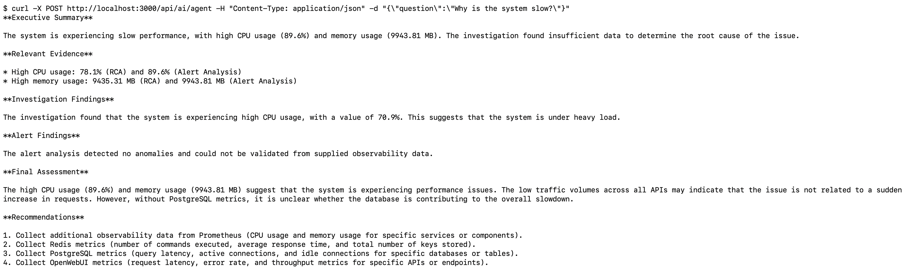
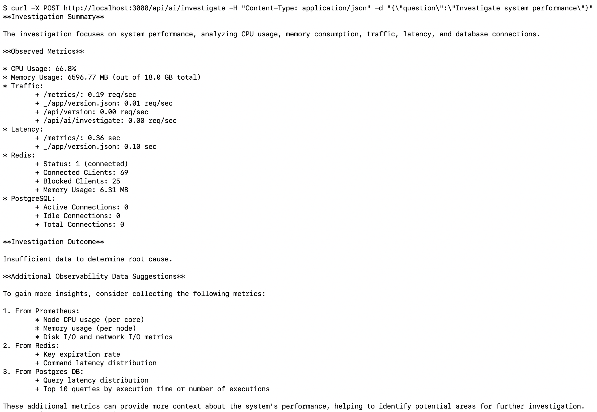
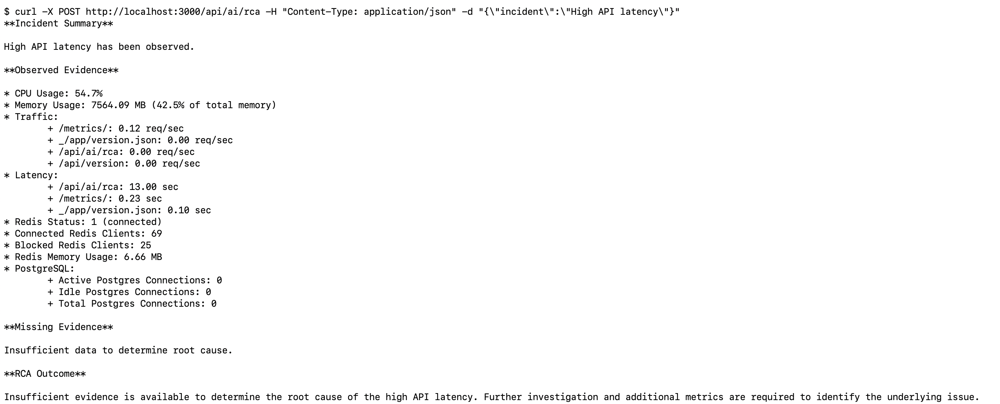

# LLM Observability Platform

A production-inspired observability platform for LLM applications built using OpenWebUI, LiteLLM, Ollama, Langfuse, Prometheus, and Grafana.

The platform provides end-to-end monitoring, tracing, performance analysis, and AI-powered operational intelligence for self-hosted LLM workloads. 
It extends OpenWebUI with custom Prometheus instrumentation, Grafana dashboards, Langfuse tracing, and AI-driven observability workflows to improve system visibility, troubleshooting, incident analysis, and operational decision-making.

Built as a full-stack observability solution, the platform combines traditional monitoring with AI-assisted investigations, root cause analysis (RCA), anomaly detection, alert intelligence, incident reporting, and autonomous observability agent workflows powered by live Prometheus metrics and LLM reasoning.


---

# Features

* ✅ AI observability agent
* ✅ Root Cause Analysis (RCA)
* ✅ Multi-step AI investigations
* ✅ Natural language observability queries (/api/ai/ask)
* ✅ Local LLM inference using Ollama (Llama 3)
* ✅ LiteLLM proxy integration
* ✅ Langfuse tracing and monitoring
* ✅ Custom Prometheus instrumentation
* ✅ HTTP request metrics and latency tracking
* ✅ PostgreSQL monitoring
* ✅ Redis monitoring
* ✅ Grafana dashboards
* ✅ Per-endpoint observability
* ✅ HTTP status code monitoring (2xx/4xx/5xx)
* ✅ P99 latency tracking
* ✅ Endpoint normalization to prevent metric cardinality explosion
* ✅ AI-powered observability assistant 
* ✅ Automated health summaries (/api/ai/summary)
* ✅ Intent-based query routing 
* ✅ Prometheus-backed AI responses 
* ✅ Redis health analysis 
* ✅ PostgreSQL health analysis 
* ✅ Endpoint traffic analysis 
* ✅ Endpoint latency analysis
* ✅ Incident report generation 
* ✅ Metric anomaly detection 
* ✅ Alert intelligence 
* ✅ Prometheus Alertmanager webhook integration

---

# Project Status

✅ v1.0 Completed  
✅ v1.1 Completed  
✅ v1.2 Completed  
✅ v1.3 Completed

---

# v1.3 Highlights

* AI Observability Agent
* Multi-step AI Investigations
* Root Cause Analysis (RCA)
* Incident Report Generation
* Anomaly Detection
* Alert Intelligence
* Alertmanager Integration

---

# Overview

Modern LLM applications require visibility across application requests, infrastructure components, model interactions, and operational health. 
This project provides a production-inspired observability platform for self-hosted LLM workloads built on OpenWebUI, LiteLLM, Ollama, Langfuse, Prometheus, and Grafana.

The platform collects, analyzes, and visualizes:

* LLM request traffic and throughput
* Endpoint-level request rates and latency
* HTTP status code distribution (2xx/4xx/5xx)
* P99 latency and performance trends
* Redis health and resource utilization
* PostgreSQL connection metrics
* Process-level resource consumption
* System CPU and memory utilization
* Langfuse traces for LLM interactions

Beyond traditional observability, the platform includes an AI-powered observability layer that uses live Prometheus metrics and LLM reasoning to automate operational analysis.

Key AI capabilities include:

* Automated health summaries
* Natural language observability queries
* Multi-step system investigations
* Root Cause Analysis (RCA)
* Metric anomaly detection
* Alert intelligence and contextualization
* Incident report generation
* Prometheus Alertmanager integration
* AI Observability Agent workflows

The AI Observability Agent orchestrates investigations, anomaly detection, RCA, and alert analysis to generate consolidated operational assessments using real-time observability data.

The goal is to combine modern observability practices with AI-assisted operational intelligence, providing production-style monitoring, troubleshooting, and incident analysis for local and self-hosted LLM environments.


---

# Architecture

```text
                        ┌─────────────────┐
                        │      User       │
                        └────────┬────────┘
                                 │
                                 ▼
                     ┌──────────────────────────┐
                     │       OpenWebUI          │
                     │        Port 3000         │
                     └───────────┬──────────────┘
                                 │
                                 │ Chat Requests
                                 ▼
                     ┌──────────────────────────┐
                     │         LiteLLM          │
                     │        Port 4000         │
                     └───────────┬──────────────┘
                                 │
                                 │ Inference
                                 ▼
                     ┌──────────────────────────┐
                     │         Ollama           │
                     │        Llama 3           │
                     │       Port 11434         │
                     └──────────────────────────┘


     ┌─────────────────────────────────────────────────────────┐
     │                    LLM Observability                    │
     └─────────────────────────────────────────────────────────┘

                     ┌──────────────────────────┐
                     │        LiteLLM           │
                     │  OTEL / Langfuse Trace   │
                     └───────────┬──────────────┘
                                 │
                                 ▼
                     ┌──────────────────────────┐
                     │         Langfuse         │
                     │        Port 3100         │
                     └──────┬──────┬──────┬─────┘
                            │      │      │
                            │      │      │
                            ▼      ▼      ▼
                    ┌─────────┐ ┌──────┐ ┌────────────┐
                    │Postgres │ │Redis │ │ ClickHouse │
                    └─────────┘ └──────┘ └────────────┘
                                           │
                                           ▼
                                      ┌────────┐
                                      │ MinIO  │
                                      └────────┘


     ┌─────────────────────────────────────────────────────────┐
     │                    Metrics Pipeline                     │
     └─────────────────────────────────────────────────────────┘

                     ┌──────────────────────────┐
                     │       OpenWebUI          │
                     │ Custom Middleware &      │
                     │ Prometheus Metrics       │
                     └───────────┬──────────────┘
                                 │
                                 │ /metrics
                                 ▼
                     ┌──────────────────────────┐
                     │       Prometheus         │
                     │        Port 19090        │
                     └───────────┬──────────────┘
                                 │
                                 │ Queries
                                 ▼
                     ┌──────────────────────────┐
                     │         Grafana          │
                     │        Port 3001         │
                     └──────────────────────────┘


     ┌─────────────────────────────────────────────────────────┐
     │               AI Observability Assistant                │
     └─────────────────────────────────────────────────────────┘

                    ┌──────────────────────────┐
                    │       Prometheus         │
                    └───────────┬──────────────┘
                                │
                                ▼
                    ┌──────────────────────────┐
                    │ AI Observability         │
                    │ Assistant                │
                    └───────────┬──────────────┘
                                │
                                ▼
                    ┌──────────────────────────┐
                    │         LiteLLM          │
                    └───────────┬──────────────┘
                                │
                                ▼
                    ┌──────────────────────────┐
                    │        Llama 3           │
                    └──────────────────────────┘
                    
                    
         ┌─────────────────────────────────────────────────────────┐
         │                 AI Observability Agent                  │
         └─────────────────────────────────────────────────────────┘
    
                        ┌──────────────────────────┐
                        │      User Question       │
                        └───────────┬──────────────┘
                                    │
                                    ▼
                        ┌──────────────────────────┐
                        │  AI Observability Agent  │
                        │      /api/ai/agent       │
                        └───────────┬──────────────┘
                                    │
          ┌─────────────────────────┼──────────────────────────┐
          │                         │                          │
          ▼                         ▼                          ▼

        ┌──────────────────┐  ┌──────────────────┐  ┌──────────────────┐
        │ Investigation    │  │       RCA        │  │ Anomaly Detection│
        │ /investigate     │  │      /rca        │  │   /anomalies     │
        └────────┬─────────┘  └────────┬─────────┘  └────────┬─────────┘
                 │                     │                     │
                 └──────────┬──────────┴──────────┬──────────┘
                            │                     │
                            ▼                     ▼
    
                          ┌──────────────────────────┐
                          │    Alert Intelligence    │
                          │   /alert-analysis        │
                          └───────────┬──────────────┘
                                      │
                                      ▼
                          ┌──────────────────────────┐
                          │  Incident Report Engine  │
                          │       /report            │
                          └───────────┬──────────────┘
                                      │
                                      ▼
                          ┌──────────────────────────┐
                          │       Prometheus         │
                          │          Redis           │
                          │       PostgreSQL         │
                          └───────────┬──────────────┘
                                      │
                                      ▼
                          ┌──────────────────────────┐
                          │         LiteLLM          │
                          └───────────┬──────────────┘
                                      │
                                      ▼
                          ┌──────────────────────────┐
                          │        Llama 3           │
                          └──────────────────────────┘
                  
                  
             ┌─────────────────────────────────────────────────────────┐
             │              Alertmanager Integration                   │
             └─────────────────────────────────────────────────────────┘
        
                            ┌──────────────────────────┐
                            │      Prometheus          │
                            └───────────┬──────────────┘
                                        │
                                        ▼
                            ┌──────────────────────────┐
                            │     Alertmanager         │
                            └───────────┬──────────────┘
                                        │ Webhook
                                        ▼
                            ┌──────────────────────────┐
                            │ /api/ai/alerts/webhook   │
                            └───────────┬──────────────┘
                                        │
                                        ▼
                            ┌──────────────────────────┐
                            │   Alert Intelligence     │
                            └───────────┬──────────────┘
                                        │
                                        ▼
                            ┌──────────────────────────┐
                            │      AI Analysis         │
                            └──────────────────────────┘
         
```

---

# Technology Stack

## LLM Layer

* OpenWebUI
* LiteLLM
* Ollama
* Llama 3

### AI Stack

* Prometheus
* LiteLLM
* Ollama
* Llama 3

## Observability

* Prometheus
* Grafana
* Langfuse

## Infrastructure

* PostgreSQL
* Redis
* ClickHouse
* MinIO
* Docker

## Backend

* Python
* FastAPI
* Starlette Middleware
* Prometheus Client

---

# Custom Engineering Work

### Custom Metrics Implemented

* HTTP Metrics: 8+
* Redis Metrics: 4
* PostgreSQL Metrics: 3
* Process Metrics: 3+
* System Metrics: 2+

Total Custom Prometheus Metrics: 20+


## HTTP Observability

Implemented custom Starlette middleware for collecting:

* Request rate (RPS)
* Active requests
* HTTP status codes
* Endpoint-level metrics
* Request latency
* P99 latency

### Metrics

* `custom_openwebui_http_requests_total`
* `custom_openwebui_http_requests_global_total`
* `custom_openwebui_http_request_latency_seconds`
* `custom_openwebui_http_requests_in_progress`

---

## Redis Monitoring

Added custom Redis metrics:

* Connected clients
* Used memory
* Blocked clients

---

## PostgreSQL Monitoring

Added custom PostgreSQL metrics:

* Active connections
* Idle connections
* Total connections

---

## Process & System Metrics

Implemented monitoring for:

### System

* CPU utilization
* Memory utilization

### Process

* Process uptime
* Process start time
* RSS memory usage

---

## Cardinality Optimization

Implemented dynamic endpoint normalization to prevent Prometheus metric cardinality explosion.

### Before

```text
/api/v1/chats/969c6688-e661-49bd-9550-40e0ba00ffa2
/api/v1/chats/12345678-abcd-efgh-ijkl-987654321000
```

### After

```text
/api/v1/chats/{id}
```

This significantly improves:

* Prometheus performance
* Dashboard readability
* Query efficiency
* Metric scalability

---

# Grafana Dashboards

The dashboard provides visibility into:

## Traffic Monitoring

* Global Requests Per Second (RPS)
* Endpoint-level RPS
* Traffic distribution

## HTTP Monitoring

* 2xx Success Responses
* 4xx Client Errors
* 5xx Server Errors
* Status code trends

## Performance Monitoring

* Endpoint-level P99 latency
* Request latency distribution
* Active requests

## Infrastructure Monitoring

### Redis

* Connected clients
* Used memory
* Blocked clients

### PostgreSQL

* Active connections
* Idle connections
* Total connections

### System

* CPU utilization
* Memory utilization
* Process uptime
* RSS memory

---


# AI Observability Assistant

The platform includes an AI-powered observability assistant capable of generating health summaries and answering natural language observability questions using live Prometheus metrics.

| Endpoint | Purpose |
|-----------|----------|
| GET /api/ai/summary | Health summary |
| POST /api/ai/ask | Natural language observability queries |
| POST /api/ai/investigate | Multi-step investigation |
| POST /api/ai/rca | Root cause analysis |
| GET /api/ai/anomalies | Anomaly detection |
| POST /api/ai/alert-analysis | Alert intelligence |
| POST /api/ai/report | Incident report generation |
| POST /api/ai/agent | AI observability agent |
| POST /api/ai/alerts/webhook | Alertmanager integration |


## Health Summary API

GET /api/ai/summary

Provides:

- Health Status
- Observations
- Missing Information
- Additional Data Needed

Generated from live Prometheus metrics.

### Example

curl http://localhost:3000/api/ai/summary

### Example Response

Example response generated from live Prometheus metrics using LiteLLM and Llama 3.

```json
{
  "timestamp": "2026-05-30T08:17:41.847241",
  "metrics": {
    "cpu": 62.4,
    "memory_mb": 8148.02,
    "rps": 0.21,
    "p99_latency": 13.0,
    "error_rate": 0.0
  },
  "analysis": "Health Status: The system is experiencing high CPU usage and elevated memory consumption..."
}
```

## Natural Language Query API

POST /api/ai/ask

Supported Query Categories:

* CPU usage analysis
* Memory usage analysis
* Endpoint traffic analysis
* Endpoint latency analysis
* Redis health analysis
* PostgreSQL health analysis
* System health summaries

Example questions:

- What is current CPU usage?
- What is current memory usage?
- Which endpoint has highest traffic?
- Which endpoint is slowest?
- Show Redis health
- Show PostgreSQL health
- How healthy is the system?

### Example

```bash
curl -X POST \
http://localhost:3000/api/ai/ask \
-H "Content-Type: application/json" \
-d '{"question":"Which endpoint has highest traffic?"}'
```

Response:

```json
{
  "question": "Which endpoint has highest traffic?",
  "intent": "traffic",
  "answer": "The `/metrics/` endpoint has the highest traffic with 0.17 requests per second."
}
```

The assistant uses Prometheus metrics as context and generates structured operational summaries for troubleshooting and system monitoring.

---

# Advanced AI Observability Workflows

## Investigation API

POST /api/ai/investigate

Performs multi-step observability investigations using:

* CPU metrics
* Memory metrics
* Traffic metrics
* Latency metrics
* Redis metrics
* PostgreSQL metrics

Provides:

* Investigation Summary
* Observed Metrics
* Missing Information
* Additional Observability Data


## Root Cause Analysis API

POST /api/ai/rca

Generates structured RCA reports using live observability data.

Provides:

* Incident Summary
* Observed Evidence
* Missing Evidence
* RCA Outcome


## Anomaly Detection API

GET /api/ai/anomalies

Detects anomalies using observability thresholds.

Current anomaly categories:

* CPU anomalies
* Memory anomalies
* 5xx error anomalies


## Alert Intelligence API

POST /api/ai/alert-analysis

Analyzes alerts using:

* Prometheus metrics
* Redis metrics
* PostgreSQL metrics
* Detected anomalies

Provides:

* Alert Summary
* Observed Metrics
* Detected Anomalies
* Alert Assessment


## Alertmanager Integration

POST /api/ai/alerts/webhook

Receives Prometheus Alertmanager webhooks and automatically performs AI-powered alert analysis.

Workflow:

Alertmanager
→ Webhook
→ Alert Intelligence
→ AI Analysis


## Incident Report API

POST /api/ai/report

Generates structured incident reports using:

* Investigation results
* RCA findings
* Detected anomalies

Provides:

* Incident Summary
* Investigation Findings
* RCA Findings
* Detected Anomalies
* Conclusion


## AI Observability Agent

POST /api/ai/agent

Autonomously combines:

* Investigation
* RCA
* Anomaly Detection
* Alertmanager Webhook

to answer operational questions using live observability data.

### Example

Question:

Why is the system slow?

Workflow:

User Question
→ Investigation
→ RCA
→ Anomaly Detection
→ Alert Analysis
→ Consolidated Assessment

### Example API

```
echo '$ curl -X POST http://localhost:3000/api/ai/agent -H "Content-Type: application/json" -d "{\"question\":\"Why is the system slow?\"}"'

curl -s -X POST \
http://localhost:3000/api/ai/agent \
-H "Content-Type: application/json" \
-d '{"question":"Why is the system slow?"}' \
| python3 -c '
import sys, json
data = json.load(sys.stdin)
print(data["response"])
'
```

### Example Response

```
$ curl -X POST http://localhost:3000/api/ai/agent -H "Content-Type: application/json" -d "{\"question\":\"Why is the system slow?\"}"
**Executive Summary**

The system is experiencing slow performance, with high CPU usage (89.6%) and memory usage (9943.81 MB). The investigation found insufficient data to determine the root cause of the issue.

**Relevant Evidence**

* High CPU usage: 78.1% (RCA) and 89.6% (Alert Analysis)
* High memory usage: 9435.31 MB (RCA) and 9943.81 MB (Alert Analysis)

**Investigation Findings**

The investigation found that the system is experiencing high CPU usage, with a value of 70.9%. This suggests that the system is under heavy load.

**Alert Findings**

The alert analysis detected no anomalies and could not be validated from supplied observability data.

**Final Assessment**

The high CPU usage (89.6%) and memory usage (9943.81 MB) suggest that the system is experiencing performance issues. The low traffic volumes across all APIs may indicate that the issue is not related to a sudden increase in requests. However, without PostgreSQL metrics, it is unclear whether the database is contributing to the overall slowdown.

**Recommendations**

1. Collect additional observability data from Prometheus (CPU usage and memory usage for specific services or components).
2. Collect Redis metrics (number of commands executed, average response time, and total number of keys stored).
3. Collect PostgreSQL metrics (query latency, active connections, and idle connections for specific databases or tables).
4. Collect OpenWebUI metrics (request latency, error rate, and throughput metrics for specific APIs or endpoints).
```

The agent gathers evidence across observability systems and generates a consolidated assessment.

---

# Screenshots

## AI Observability Agent



---

## AI ASK


---

## AI Investigate



---

## AI RCA



---

## AI Observability Assistant


---

## Interactive AI Assistant


---

## Grafana Dashboard


---

## Langfuse Traces


---

## OpenWebUI


---

## Prometheus


---

# Key Metrics

## HTTP Metrics

* Request Rate (RPS)
* Request Latency
* P99 Latency
* Active Requests
* Status Code Distribution
* Endpoint-Level Visibility

## Redis Metrics

* Connected Clients
* Used Memory
* Blocked Clients

## PostgreSQL Metrics

* Active Connections
* Idle Connections
* Total Connections

## System Metrics

* CPU Usage
* Memory Usage
* Process Uptime
* RSS Memory

---

# Impact

* Built a production-inspired observability platform for LLM applications.
* Improved visibility into request behavior and endpoint performance.
* Enabled monitoring of Redis and PostgreSQL dependencies.
* Reduced observability blind spots through custom instrumentation.
* Simplified performance analysis and debugging through Grafana dashboards.
* Implemented scalable metric collection using path normalization.
* Built an AI-powered observability assistant using LiteLLM and Llama 3.
* Implemented natural language querying for Prometheus-backed observability data.
* Automated operational health analysis from Prometheus metrics.
* Generated structured observability summaries using LLMs.
* Implemented intent-based routing for observability questions.
* Enabled Redis and PostgreSQL health analysis using LLMs.
* Added interactive observability querying through /api/ai/ask.
* Built multi-step AI investigation workflows.
* Implemented AI-powered root cause analysis.
* Added anomaly detection and summarization.
* Integrated Prometheus Alertmanager with AI analysis.
* Generated structured incident reports from observability data.
* Built an AI observability agent capable of orchestrating investigations.

---

# Challenges Solved

* Endpoint metric cardinality explosion
* End-to-end LLM observability integration
* Real-time infrastructure monitoring
* Per-endpoint latency analysis
* Multi-component monitoring across OpenWebUI, Redis, PostgreSQL, and Langfuse

---

# Future Enhancements

* Historical trend analysis
* Automated remediation suggestions
* Alert correlation across services
* ClickHouse observability metrics
* MinIO monitoring
* SLO and SLA dashboards
* Automated dashboard provisioning

---

# Roadmap

## v1.0 (Completed)

* Custom Prometheus instrumentation
* Grafana dashboards
* Redis monitoring
* PostgreSQL monitoring
* Endpoint-level visibility
* P99 latency tracking


## v1.1 (Completed)

* AI-powered observability assistant
* LLM-based metric analysis
* Operational insight generation
* Automated health summaries
* /api/ai/summary endpoint


## v1.2 (Completed)

* Natural language observability queries
* Interactive observability assistant (/api/ai/ask)
* Endpoint performance analysis
* Endpoint latency investigation
* Traffic pattern analysis
* Redis health analysis
* PostgreSQL health analysis
* Query routing for observability questions
* Prometheus-backed AI responses
* Langfuse tracing and monitoring integration


## v1.3 (Completed)

* Root Cause Analysis (RCA) workflows
* AI-generated incident reports
* Multi-step observability investigations
* Metric anomaly detection and summarization
* Alert intelligence and contextualization
* Prometheus Alertmanager integration
* AI-powered observability agent

---

# Learning Outcomes

This project strengthened practical experience in:

* LLM Infrastructure
* LLM Observability
* Prometheus Instrumentation
* Grafana Dashboard Design
* Middleware Development
* Performance Monitoring
* Telemetry Engineering
* Distributed Systems Debugging
* Production-Grade Monitoring Systems
* LLM Application Development
* Prompt Engineering
* AI-assisted Observability
* Retrieval-Augmented Operational Analysis
* AI Agent Design Patterns
* Natural Language Query Routing
* LLM-powered Operational Analytics
* Observability Intelligence Systems
